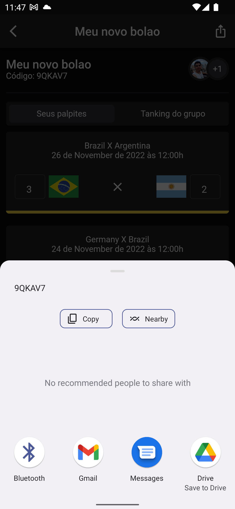

<br>
<br>

this is a [Flutter](https://flutter.dev/) project

<b>flutter >= 3.3.4</b>

```js
flutter pub get
flutter run --debug
```


<br>
<br>
<p align="center">
   Feito com ❤️ by <a target="_blank" href="https://welitonsousa.github.io"><b>Weliton Sousa</b></a>
</p>


