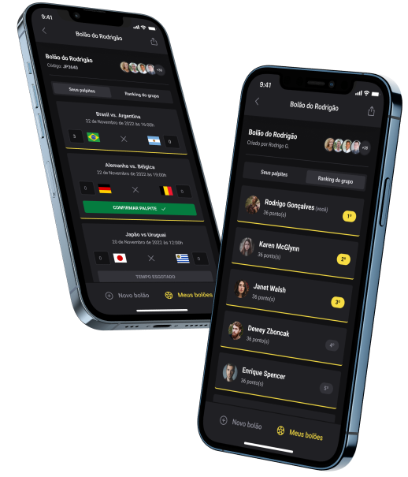

<br>




#### runner server
<p>access the server 
   <a 
   target="_blank" 
   href="https://github.com/welitonsousa/nlw-copa/tree/main/server"
   >repository</a>
</p>
<b>node >= 18.22.0</b>

```js
cd server               // enter the directory
docker-compose up -d    // up local database 
npx prisma migrate dev  // apply changes database
npm install
npm run dev
```

#### runner web application

<p>access the web 
   <a 
   target="_blank" 
   href="https://github.com/welitonsousa/nlw-copa/tree/main/web"
   >repository</a>
</p>
<b>node >= 18.22.0</b>

```js
cd web         // enter the directory
npm install
npm run dev
```

#### runner mobile application
<p>access the mobile 
   <a 
   target="_blank" 
   href="https://github.com/welitonsousa/nlw-copa/tree/main/mobile"
   >repository</a>
</p>
<b>flutter >= 3.3.4</b>

```js
cd mobile         // enter the directory
flutter pub get
flutter run --debug
```

<br>
<br>
<p align="center">
   Feito com ❤️ by <a target="_blank" href="https://welitonsousa.github.io"><b>Weliton Sousa</b></a>
</p>