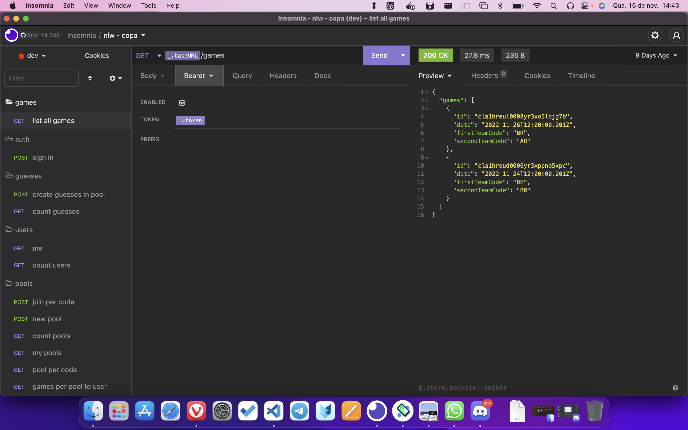

<br>



<a target="_blank" href="./assets/insomnia-file.json">get the insomnia file</a>


#### runner server
this is a [Node](https://nodejs.org/) project

<b>node >= 18.22.0</b>

```js
cd server               // enter the directory
docker-compose up -d    // up local database 
npx prisma migrate dev  // apply changes database
npm install
npm run dev
```


<br>
<br>
<p align="center">
   Feito com ❤️ by <a target="_blank" href="https://welitonsousa.github.io"><b>Weliton Sousa</b></a>
</p>